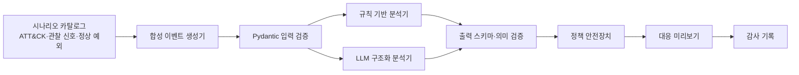

# 3주차 논리 아키텍처 초안

## 1. 설계 목표

아키텍처는 LLM을 실제 집행 주체로 사용하지 않고 **구조화된 판단 후보를 만드는 분석 모듈**로 제한한다. 시나리오 정의, 이벤트 입력, 분석 결과, 정책 결정을 각각 다른 계약으로 관리한다.

## 2. 전체 흐름

3주차에 직접 확정한 경로는 `시나리오 카탈로그 → 합성 이벤트 생성기 → Pydantic 입력 검증`이다. 뒤쪽 모듈은 전체 연결 방향을 표현하되 이번 주 완료 범위로 산정하지 않는다.

## 3. 모듈별 책임

| 모듈 | 책임 | 주요 계약 |
|---|---|---|
| `app/scenarios.py` | 정상·위협 시나리오와 합성 이벤트를 제공 | `ScenarioSummary`, `SecurityEvent` |
| `app/models.py` | 입력·출력·정책 객체의 형식과 허용값을 검증 | Pydantic 모델 |
| `app/analyzers/` | 이벤트를 위험도·근거·대응 후보로 변환 | `SecurityAssessment` |
| `app/services/policy.py` | 금지 대응, 저신뢰, 고위험 결과를 사람 검토로 전환 | `PolicyDecision` |
| `app/services/audit.py` | 결과와 응답시간을 기록하고 조회 | `AnalysisResult` |
| `app/main.py` | HTTP 요청·응답 경계와 오류 상태를 제공 | FastAPI 엔드포인트 |

## 4. 데이터 경계

### 분석기로 전달하는 것

- 시각과 이벤트 ID
- 사용자 역할과 계정 상태
- 기기 관리 여부와 보안 상태
- 접속 방식과 위치 이상
- 자원 민감도와 요구 역할
- MFA, 실패 횟수, 세션 상태
- 요청 빈도, 전송량, 다수 자원 접근, 예외 승인

### 분석기로 전달하지 않는 것

- `ground_truth.risk_level`
- `ground_truth.expected_action`
- 실제 조직의 사용자 이름·이메일·내부 자원명
- API 키와 기타 비밀정보

## 5. 제어 지점

| 지점 | 실패 상황 | 안전한 처리 |
|---|---|---|
| 입력 검증 | 필수 필드, 자료형, 허용값 오류 | 분석을 시작하지 않음 |
| LLM 출력 | 스키마 불일치나 파싱 실패 | 정책 엔진으로 전달하지 않음 |
| 의미 검증 | CRITICAL인데 ALLOW 권고 | HOLD_FOR_REVIEW로 교체 |
| 정책 집행 | 실제 계정·권한 변경 요청 | 현재는 미리보기만 반환 |
| 감사 기록 | 비밀정보가 로그에 포함 | 키와 실제 기업 로그를 기록하지 않음 |

## 6. 4주차에 검토할 설계 문제

1. 시나리오 관찰 신호를 코드에서 자동 검사할 수 있는 조건식으로 옮길 것인가?
2. 규칙 점수와 LLM 판단이 다를 때 어떤 조건에서 사람 검토로 보낼 것인가?
3. 승인된 예외의 유효기간·승인자·적용 자원을 어떻게 표현할 것인가?
4. 현재 자유 문자열인 역할과 자원 유형을 조직 정책과 어떻게 연결할 것인가?
